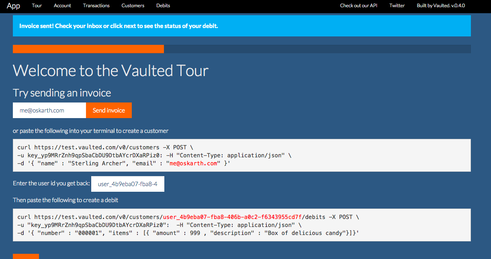
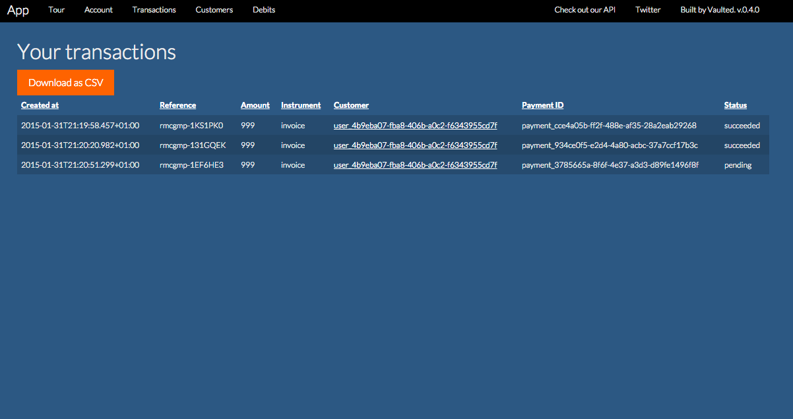

# Vaulted app

For merchant that don't live in the terminal. A dashboard / tour / CRM app.

app.vaulted.com

## Screenshots



*Interactive tour.*



*Example view with downloadable CSV.*

## Development

To autocompile Clojurescript, run

```
lein cljsbuild auto
```

and

```
lein repl
(run)
```

Logging will be printed in the repl.

You can also use `lein figwheel` to watch for .cljs changes, but this is
sometimes brittle.

To inspect the state, the easiest way is to print the app state (or a subset
thereof)

```
[:p (str "APP STATE: " @state/app-state)] ;; debug
```

on a web page.

Features and bug requests to @oskarth.
